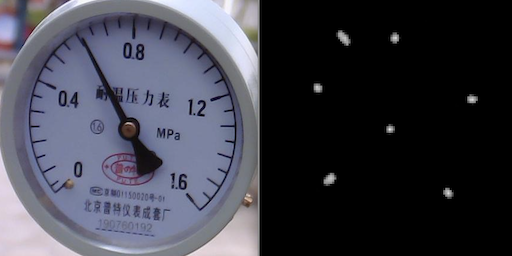

# HEATMAP for Keypoints Detection/Semantic Segmentation
## Introduction
HEATMAP is a 2D keypoints detection/semantic segmentation framework based on the [YOLOXE](https://github.com/leogift/yoloxe) series of 2D detectors， supporting rknn models.

Kudos to the YOLOX team.




## Complaint
As previously mentioned in YOLOXE, one-stage regression-based keypoint detection methods, such as YOLO-Pose, generally underperform compared to heatmap-based approaches like OpenPose and CenterNet. This limitation has led to the adoption of a two-stage detection framework in practical engineering applications. In Stage 1, bounding boxes are detected. In Stage 2, further processing—such as classification, semantic segmentation, keypoint detection, or oriented bounding box estimation—is performed on each detected bounding box. This work focuses on semantic segmentation and keypoint detection.

## Modification
- use regnet as backbone
- use ReLU as activation
- including keypoints/mask dataloader and estimation head
- including aux head
- including uncertainty balance
- including rknn exporting tools
- including grad accumulation training

* For more operations, please refer to the files under the 'exps' directory.

## Quick Start

<details>
<summary>Install</summary>

```shell
pip3 install -r requirements.txt
```
</details>

<details>
<summary>Train</summary>

Step1. Prepare dataset
* Please refer to the example files under the 'datasets' directory.

Step2. Train on COCO:

```shell
python3 -m heatmap.tools.train -f exps/kpts/kpts_regnet_x_400mf.py -b32 --fp16
python3 -m heatmap.tools.train -f exps/mask/mask_regnet_x_400mf.py -b32 --fp16 --resume
```

* -f: exp config file
* -b: total batch size
* --fp16: use fp16 training
</details>


<details>
<summary>Export</summary>

Use the following command:
```shell
python3 -m heatmap.tools.export_onnx -f exps/mask/mask_regnet_x_400mf.py -c HEATMAP_outputs/mask_regnet_x_400mf/best_ckpt.pth -o onnx_outputs/mask.onnx
```

* -output-name: output onnx file path.
* -f: exp config file
* -c: ckpt file

</details>


<details>
<summary>Export RKNN</summary>

Use the following command:
```shell
python3 -m yoloxe.tools.onnx2rknn -m onnx_outputs/mask.onnx -q quant_cable.txt
```

* -m: onnx model file

</details>

## Pretrain
- YOLOXE-regnet_x_400mf: https://pan.baidu.com/s/1PNDBVvZviUz82L-bFmkPPg?pwd=yxe4
- YOLOXE-regnet_x_800mf: https://pan.baidu.com/s/1G5hnsmjjvew07FWekSORsQ?pwd=yxe8